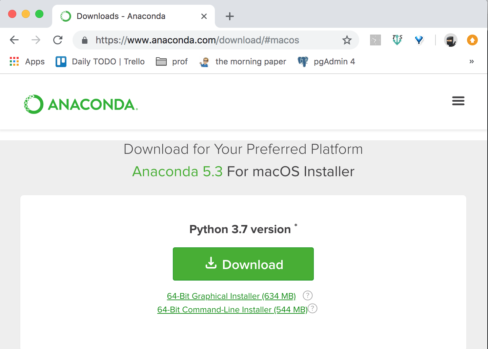
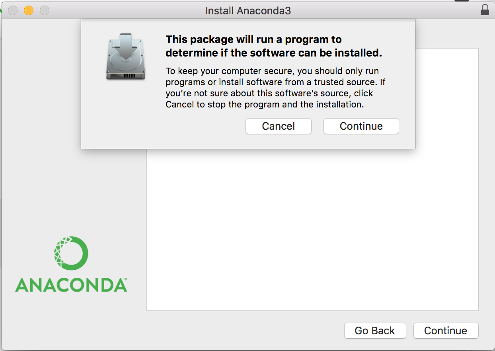
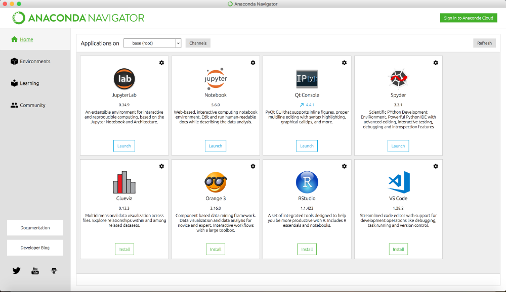

# **Python3 설치하기 - OS X**

리눅스, 맥 OS X의 경우 기본적으로 파이썬2가 설치되어있습니다. 파이썬3을 위해 아나콘다를 설치하도록 하겠습니다.

1. ## 2. Anaconda 설치

   파이썬을 설치하게 되면 파이썬 패키지 관리가 어렵고 여러가지 다양한 추가 도구를 설치해야 하기 때문에 배포판으로 설치하는 하는 것이 좋다. 배포판에는 패키지 관리 시스템, 콘솔 등을 포함하고 있다. 다양한 배포판 중에 아나콘다를 설치하도록 하겠다.

   1. https://www.anaconda.com/download/에서 -> Mac OS 용 찾기 -> 다운로드

      

   2. 다운로드 받은 파일을 실행 -> 전체 설정은 디폴트 값으로 진행해도 무방하다.
      

      Microsoft Visual Studio Code는 설치할 필요가 없다.

   3. LaunchPad -> Anaconda navigator를 실행한다. 

   

   1. 

   4. Jupyter Notebook을 실행한다.
      실행 시 웹서버 프로세스가 실행되는 콘솔 창이 실행되고 동시에 http://localhost:8888/tree 주소로 웹 브라우저가 가동된다.   
      웹서버 프로세스가 돌아가는 커멘드 창을 닫으면 주피터 노트북 웹서버가 중지되므로 주피터 노트북 사용이 끝날 때까지 콘솔 창을 닫으면 안된다.
      

Reference:
http://kybin.github.io/translateDiveIntoPython3korean/installing-python.html

