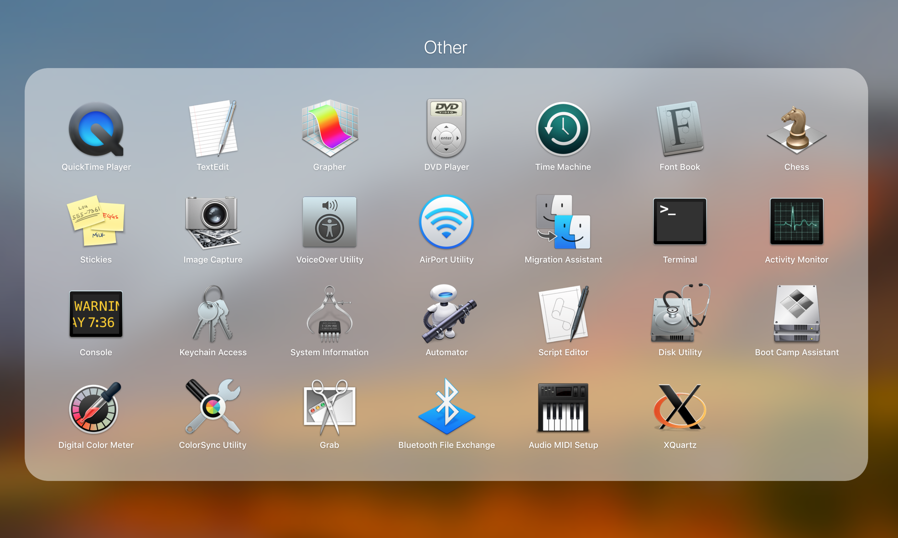
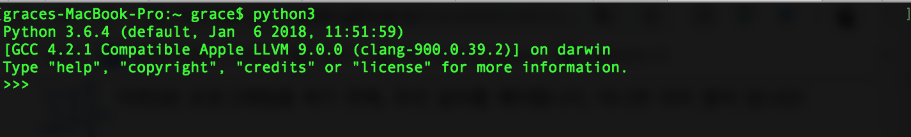

# **Python3 설치하기 - OS X**

## 1. 내 시스템 확인하기.

리눅스, 맥 OS X의 경우 기본적으로 파이썬2가 설치되어있습니다. 하지만 파이썬3를 설치되어있지 않습니다. 컴퓨터 OS에 파이썬3가 설치되어있는지 확인하는 가장 쉬운 방법은 커맨라인 창으로 들어가는 겁니다.

1. Applications -> Terminal
   어플리케이션 중 터미널을 선택해 실행합니다. 맥에서 command + space키를 활용해 terminal을 입력해 실행할 수도 있습니다.

2. Command line -> python3
   실행된 command 창에서 python3를 입력하고 엔터를 칩니다.

   

   만약 다음과 같이 파이썬3이 실행된다면, 이미 파이썬3이 설치된 상태입니다.