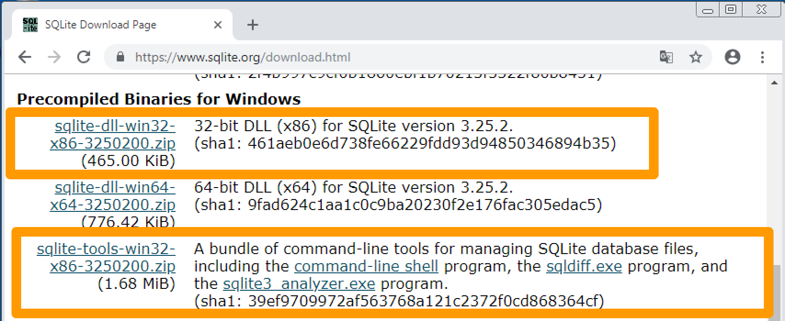
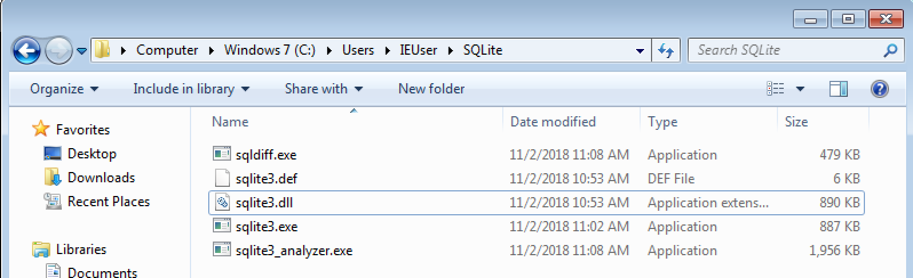

# SQLite

## 윈도우에서 SQLite 설치하기

1. https://www.sqlite.org/download.html 다운로드 페이지에서 윈도우용 바이너리(Precomplied Binaries for Windows) 파일을 받는다. 밑의 경우 32비트라 tools를 포함해 두가지 파일을 받는다.
   

2. 다운로드한 ZIP파일들의 압축을 풀어 모두 원하는 폴더로 이동한다.
   

3. sqlite3.exe 파일을 더블클릭하여 실행한다.
   명령 프롬프트에서 다음과 같은 화면이 정상출력되면 설치된 것이다. 종료할 때는 .quit 을 입력한다.

   

- Database & SQL을 위한 IDE는 실습에서는 활용하지 않습니다만, 다양한 IDE의 종류가 존재합니다. (DataGrip, DBeaver, Toad, SQLiteBrowser)
- 본 실습에서는 커맨드 창을 활용하여 SQLite를 배울 예정입니다.

참조 : 

- https://wikidocs.net/5326
- 모바일 데이터베이스 SQLite3 (위키북스)