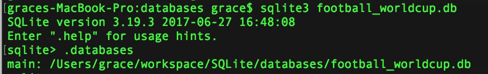
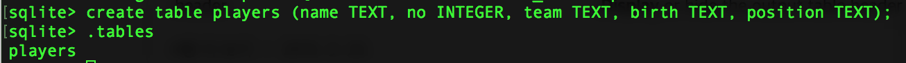

# SQLite 기본

- ## Database 

  | 이름           | 등번호 | 팀                      | 생년월일 | 포지션 |
  | -------------- | ------ | ----------------------- | -------- | ------ |
  | David SILVA    | 21     | Manchester City (ENG)   | 08/01/86 | FW     |
  | BERNARDO SILVA | 11     | Manchester City (ENG)   | 10/08/94 | MF     |
  | Paul POGBA     | 6      | Manchester United (ENG) | 15/03/93 | MF     |
  | SON Heungmin   | 7      | Tottenham Hotspur (ENG) | 08/07/92 | FW     |

  데이터베이스에 위와 같이 열과 행으로 구조화된 테이블 형태로 데이터를 저장하게 됩니다.

  행(Row)은 테이블에서 가로 방향으로 나열된 값의 집합으로 Record 혹은 Tuple이라고 합니다.
  열(Column)은 테이블에서 세로 방향으로 나열된 값의 집합으로 Field, Column이라고 부릅니다.

  이렇게 자료를 저장하는 구조와 표현방식을 스키마(Schema)라고 하며, 레코드를 입력, 조회, 수정, 삭제 할 때는 정의된 스키마에 맞게 구문을 작성해야 합니다.


- ## SQLite란

  SQLite는 데이터베이스 관리 시스템(DBMS; Database Management System)입니다. DBMS는 여러 사용자 또는 응용 프로그램이 데이터를 저장하거나 조화할 수 있게 도와주는 시스템 입니다. 대표적인 예로는 MySQL, PostgreSQL, Oracle 등이 있습니다.

  SQLite는 설치나 설정에서 'Lite'한 DBMS 입니다. 어플리케이션에서 내부 데이터를 저장 할 때도 사용하기 적합하기 때문에 안드로이드나 아이폰 어플리케이션에서 많이 사용되고 있습니다.

  SQLite의 특징으로는

  1. 단일 데이터베이스 파일: SQLite에서는 모든 정보다 단 하나의 파일에 저장됩니다. 즉 테이블 스키마, 레코드 데이터, 인덱스과 같은 정보가 한 파일에 저장되며, SQLite API로 데이터베이스를 열 때도 해당 파일의 이름을 인자로 받습니다.

  2. 간결성: 페이지 크기 제한이 있으며, 데이터베이스 파일이 파일시스템에 파일로 저장되기 때문에 파일 크기 제한이 있는 경우 데이터베이스가 동작하는데 문제가 생길 수 있습니다. 따라서 큰 데이터를 저장하지 않는 편이 좋고 어쩔 수 없는 경우에는 데이터를 여러 데이터베이스 파일로 나눠서 저장하는 것이 좋습니다.

  3. 동시성: 읽기는 여러프로세스에서 가능하지만, 쓰기는 한 순간에 오직 하나의 프로세스만 가능합니다.

  4. DROP COLUMN, ALTER COLUMN, ADD CONSTRAINT 같은 구문은 지원하지 않습니다. 하지만 동적 자료형(자료형은 그것을 저장하는 저장소가 아닌 값 자체에 의해 결정된다는 점- 테이블 생성시에 선언한 컬럼의 자료형과 일치하지 않는 데이터도 저장할 수 있다)과 RENAME TABLE을 활용하여 기능을 동일하게 구현할 수 있다.

     (더 상세한 정보)[https://www.sqlite.org/lang.html]


- ## SQLite3 자료형

  SQLite3에서 데이터베이스에 입력 가능한 자료형은 다음과 같습니다.

  | 타입    | 설명                                | 예제                           |
  | ------- | ----------------------------------- | ------------------------------ |
  | NULL    | 값이 정의되지 않거나 존재하지 않음. | NULL                           |
  | INTEGER | 부호를 갖는 정수형 데이터           | -1, 0, 1234                    |
  | REAL    | 부호를 갖는 소수점 데이터           | 3.14, 0.001                    |
  | TEXT    | 문자열 데이터                       | "데이터베이스", "Steve's book" |
  | BLOB    | 바이너리 데이터                     | x'0101                         |

- ## SQL(Structured Query Language) 이란

  데이터베이스에서 데이터를 읽고 쓰기 위해 특별히 고안된 언어를 지칭합니다. SQLite SQL 키워드는 대소문자를 구별하지 않습니다. 테이블 명과 컬럼 명도 대소문자를 구별하지 않습니다.

  SQL의 종류는 크게 세가가 있습니다.

  - DDL (Data Definition Language): 데이터베이스 객체(테이블, 뷰, 인덱스)의 구조를 정의 합니다.

    | SQL    | 내용          |
    | ------ | ------------- |
    | CREATE | 객체 생성     |
    | DROP   | 객체 삭제     |
    | ALTER  | 객체를 재정의 |

  - DML (Data Manipulation Language): 데이터의 삽입, 삭제, 갱신

    | SQL    | 내용 |
    | ------ | ---- |
    | INSERT | 입력 |
    | DELETE | 삭제 |
    | UPDATE | 수정 |

  - DCL (Data Control Language): 사용자 권한을 제어

    | SQL    | 내용      |
    | ------ | --------- |
    | GRANT  | 권한 부여 |
    | REVOKE | 권한 취소 |


  0. 커멘드 창을 엽니다(윈도우에서는 윈도우버튼 -> cmd입력, OS X에서는 Spotlight[command + space]를 통해 Terminal 을 실행합니다). 

  1. cd 명령어를 통해 sqlite3.exe파일이 있는 폴더로 이동합니다. 
     해당 폴더에서 mkdir 명령을 활용해 데이터베이스 파일을 저장할 폴더를 생성합니다.

     ```shell
     mkdir databases
     ```

     해당 폴더로 이동합니다.

     ```shell
     cd databases
     ```

  2. 데이터베이스 생성 명령어를 입력합니다. [데이터베이스 이름].db

     ```shell
     sqlite3 football_worldcup.db
     ```

     

     데이터베이스가 생성되고 연결 된것을 확인할 수 있습니다.


     ### 테이블 생성

     CREATE TABLE [테이블 이름] ( [컬럼 이름], [자료형], ...);

     ```sqlite
     CREATE TABLE players 
     (
         name TEXT, 
         no INTEGER, 
         team TEXT, 
         birth TEXT, 
         position TEXT
     );
     ```

     

  ### 

  	###      테이블 삭제

  ​	


  	###      데이터 추가

  ​	INSERT INTO [테이블 이름] ([컬럼 이름], …) VALUES ([컬럼 값],...);

  ``` sqlite
  INSERT INTO players (name, no, team, birth, position)
  VALUES ('David SILVA', 21, 'Manchester City (ENG)', '08/01/86', 'FW');
  ```

  ​	모든 컬럼에 순서대로 값을 넣을 때는 (위와 같이), 컬럼명을 생략 할 수 있다.


참고자료: 

- 빠르게 활용하는 모바일 데이터베이스 SQLite(위키북스)
- http://www.gurubee.net/lecture/1003
- https://wikidocs.net/12468