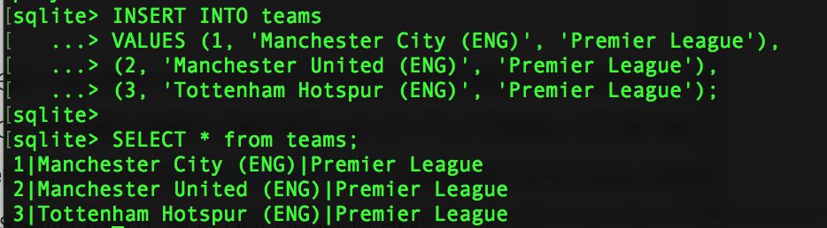
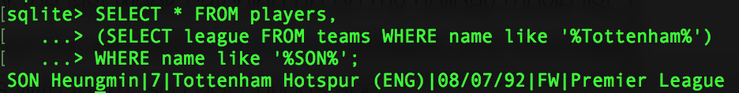
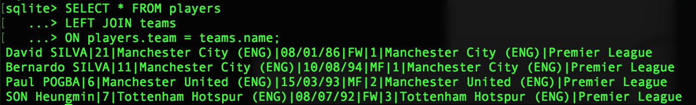

# SQLite 기본2

- ### 원하는 순서로 조회하기 (ORDER BY)


- ```sqlite
  SELECT name from players ORDER BY name;
  ```

  역순

  ```sqlite
  SELECT name from players ORDER BY name DESC;
  ```

- ### 날짜 값을 원하는 포맷으로 맞추기 (STRFTIME)

  ```sqlite
  SELECT STRFTIME('%Y-%m-%d %H:%M:%S', 'now);
  ```

  

  ```
  SELECT STRFTIME('%Y-%m-%d', birth) FROM players;
  ```


- ### 집계 함수

  - count() : 행의 수를 센다

    ```sqlite
    SELECT count(*) FROM players;
    ```

  - max() : 최대값, min() : 최소값

    ```sqlite
    SELECT max(height) FROM players;
    ```

  - sum() : 합계

    ```sqlite
    SELECT sum(height) FROM players;
    ```

  - avg() : 평균

    ```sqlite
    SELECT avg(height) FROM players;
    ```


- ### 그룹화 (GROUP BY)

  ```sqlite
  SELECT team, count(*) FROM players GROUP BY team;
  ```

  ### HAVING

  ```sqlite
  SELECT team, count(*) 
  FROM players 
  GROUP BY team
  HAVING count(*) > 1;
  ```


- ### Nested Query(중첩 질의)

  : 원하는 데이터를 조회하기 위해 여러 테이블에 SELECT 문을 수행해야 하는 어려움이 있을때, nested query나 join을 활용하여 하나의 SELECT문으로 원하는 결과를 얻을 수 있습니다.
  Nested Query = SQL 문 안에 또 다른 SQL 문이 있는 구조 입니다.

  이를 위해 새로운 팀 테이블을 생성하겠습니다.

  ```sqlite
  CREATE TABLE teams
  ( 
  	id INTEGER,
  	name TEXT,
  	league TEXT
  );
  ```

  players 테이블에 등록된 선수들을 위한 팀 정보를 입력하겠습니다.

  ```sqlite
  INSERT INTO teams (id, name, league)
  VALUES 	(1, 'Manchester City (ENG)', 'Premier League'),
  		(2, 'Manchester United (ENG)', 'Premier League'),
  		(3, 'Tottenham Hotspur (ENG)', 'Premier League');
  ```

  


  간단하게, 팀 이름을 기준으로 Nested query를 통해 손흥민 선수가 소속된 팀의 리그 정보까치 추출 해보도록 하겠습니다.

  먼저, 리그 정보만을 추출하는 SELECT 문을 구성해봅니다. (nested query가 될 예정입니다.)

  ```sqlite
  SELECT league FROM teams WHERE name like '%Tottenham%';
  ```

  ```sqlite
  SELECT * FROM players,
  	(SELECT league FROM teams WHERE name like '%Tottenham%')
  where name like '%SON%';
  ```

  


- ### Join

  : Join연산은 SELECT 문에서 특수한 구문을 사용해 2개 이상의 테이블을 하나로 연결해 조회하는 방법으로 각 테이블에서 필요한 컬럼을 추출해서 단일 결과를 얻을 수 있습니다.

  


  위의 중첩 손흥민 선수의 중첩 질의는 간단한 예제를 실행해 본 것이고, 전체 선수에 대한 정보와 해당 선수의 리그 정보까지를 추출해보겠습니다. 

  해당 예제는 위의 그림에서 A를 players 테이블로 가정하고, B를 teams 테이블로 가정하여 LEFT JOIN으로 진행해보도록 하겠습니다.

  ```sqlite
  SELECT * FROM players
  LEFT JOIN teams
  ON players.team = teams.name;
  ```

  


  더 다양한 예제는 다음 실습에서 python과 함께 활용하여 진행하도록 하겠습니다.

- ### 기존 데이터베이스 열기

  .open [db파일 위치] : 홈에서 부터의 위치

  ```sqlite
  .open Users/grace/workspace/SQLite/databases/football_worldcup.db
  ```

  


참조: 

- https://medium.com/jbennetcodes/how-to-rewrite-your-sql-queries-in-pandas-and-more-149d341fc53e
- 빠르게 활용하는 모바일 데이터베이스 SQLite3(위키북스)