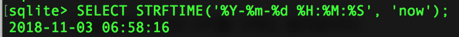
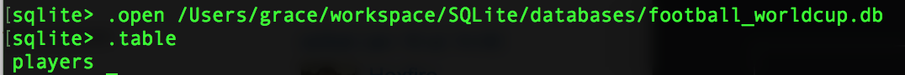

# SQLite 기본2

- ### 컬럼 값의 자동 증가 (AUTOINCREMENT)

  테이블을 생성할 때 주로 ID 컬럼에 대해서 AUTOINCREMENT 속성을 설정 할 수 있습니다.


- ### 원하는 순서로 조회하기 (ORDER BY)

  ```sqlite
  SELECT name from players ORDER BY name;
  ```

  역순

  ```sqlite
  SELECT name from players ORDER BY name DESC;
  ```

- ### 날짜 값을 원하는 포맷으로 맞추기 (STRFTIME)

  ```sqlite
  SELECT STRFTIME('%Y-%m-%d %H:%M:%S', 'now);
  ```

  

  ```
  SELECT STRFTIME('%Y-%m-%d', birth) FROM players;
  ```


- ### 집계 함수

  - count() : 행의 수를 센다

    ```sqlite
    SELECT count(*) FROM players;
    ```

  - max() : 최대값, min() : 최소값

    ```sqlite
    SELECT max(height) FROM players;
    ```

  - sum() : 합계

    ```sqlite
    SELECT sum(height) FROM players;
    ```

  - avg() : 평균

    ```sqlite
    SELECT avg(height) FROM players;
    ```


- ### 그룹화 (GROUP BY)

  ```sqlite
  SELECT team, count(*) FROM players GROUP BY team;
  ```

  ### HAVING

  ```sqlite
  SELECT team, count(*) 
  FROM players 
  GROUP BY team
  HAVING count(*) > 1;
  ```


- ### 기존 데이터베이스 열기

  .open [db파일 위치] : 홈에서 부터의 위치

  ```sqlite
  .open Users/grace/workspace/SQLite/databases/football_worldcup.db
  ```

  

