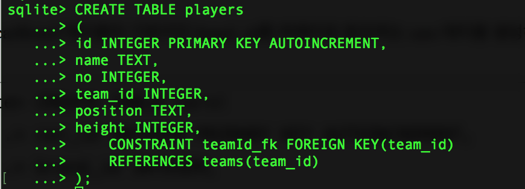
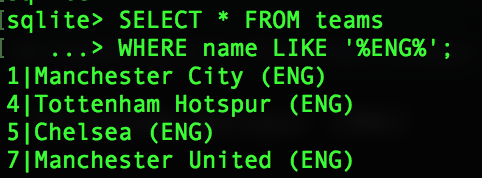

# SQLite 기본2

- ## Key

  1) Primary Key : 기본키를 구성하는 컬럼은 테이블에서 레코드를 식별할 수 있도록 유일해야 한다.

  SQLite3에서 기본키는 CREATE TABLE 구문을 통해서 생성 가능하며, PRIMARY KEY라는 키워드를 명시적으로 지정해야 한다.

  CREATE TABLE [테이블명] (컬럼명 자료형 PRIMARY KEY);

  ```sqlite
  CREATE TABLE teams
  (
  	team_id INTEGER PRIMARY KEY,
  	name TEXT
  );
  ```

  


  PRIMARY KEY가 유일한 식별자라고 했으니, 테스트를 해보겠습니다.

  ```sqlite
  INSERT INTO teams
  VALUES (1, 'Manchester United');
  ```

  

  첫번째 레코드이니 잘 들어갑니다.

  그럼 같은 키값으로 새로운 데이터 추가 시도를 해보도록 하겠습니다.


  ```sqlite
  INSERT INTO teams
  VALUES (1, 'Real Madrid');
  ```

  

  식별자 유일성이 깨진다고 오류 메세지가 뜨네요.

  ```sqlite
  SELECT * FROM teams;
  ```

  

  그리고 전체 데이터를 확인해보면 오류 나기 이전에 존재한 데이터만 있는 것을 확인하실 수 있습니다.

  PRIMARY KEY는 꼭 하나의 컬럼으로 구성할 필요 없이, 여러 컬럼으로 구성할 수도 있습니다. 이는 합성키, 복합키 (COMPOSITE KEY)라고 합니다.


  ### AUTOINCREMENT

  **PRIMARY KEY**를 INTEGER로 정의해놓았는데, 매번 데이터가 추가 될 때마다, 값을 하나씩 올려서 데이터를 추가해주기는 너무 귀찮으니, 식별자 키가 데이터가 추가될  때 마다 알아서 하나씩 올라가도록 설정을 해보겠습니다.

  먼저 기존의 테이블을 삭제하겠습니다.

  ```sqlite
  DROP TABLE teams;
  ```


  CREATE TABLE [테이블명] (

   컬럼명 데이터_타입, PRIMARY KEY AUTOINCREMENT,

   컬럼명 데이터_타입

  );

  ```sqlite
  CREATE TABLE teams
  (
  	team_id INTEGER PRIMARY KEY AUTOINCREMENT,
  	name TEXT
  );
  ```

  


  그럼, 이제 계속 레코드를 추가해도 알아서 식별자 아이디 값이 커지는 것을 확인해보겠습니다.

  ```sqlite
  INSERT INTO teams (name) VALUES('Manchester United');
  ```

  


  ```sqlite
  INSERT INTO teams (name) VALUES('Real Madrid');
  ```

  


  2) FOREIGN KEY: 테이블의 한 필드가 다른 테이블의 기본키 필드를 참조 할 때, 이를 외래키(FOREIGN KEY)라고 합니다.

  **외래키를 통해 두 테이블을 연결하고 관계성을 가지게 할 수 있습니다.** 또한 여러 테이블에 정보를 저장하고 관리 할 수 있도록 함으로써 중복된 데이터를 없애고 확장성을 가지게 해줍니다.


  SQLite3에서 외래키 설정은 테이블 생성 시에 가능합니다.

  필요한 구문은 	

  - CONSTRAINT

     - FOREIGN KEY (컬럼_이름)
     - REFERENCES [상위테이블] (참조_컬럼명)


  ```sqlite
  CREATE TABLE players
  (
  	id INTEGER PRIMARY KEY AUTOINCREMENT,
  	name TEXT,
  	no INTEGER,
  	team_id INTEGER,
  	position TEXT,
  	height INTEGER,
      CONSTRAINT teamId_fk FOREIGN KEY(team_id)
      REFERENCES teams(team_id)
  );
  ```

  


  생성한 외래키가 활성화 되어있는지 확인합니다.

  ```sqlite
  PRAGMA foreign_keys;
  ```

  

   0 = 비활성화, 1 = 활성화


  외래키가 활성화 되어있지 않다면, 활성화 해줍니다.

  ```sqlite
  PRAGMA foreign_keys = 1;
  ```

  


  이제, 데이터를 추가해보겠습니다.


  ```sqlite
  INSERT INTO players (name, no, team_id, position, height)
  VALUES ('David SILVA', 21, 1, 'FW', 170);
  ```

  


  만약, 존재하지 않는 팀 아이디로 데이터를 추가하려고 시도하면 어떻게 될까요?


  ```sqlite
  INSERT INTO players (name, no, team_id, position, height)
  VALUES ('Paul POGVA', 10, 5, 'FW', 170);
  ```

  


  외래키 제한 오류가 나면서, 데이터가 추가되지 않습니다.
  이렇게 외래키 제한을 추가하게 되면, 반드시 상위 테이블에 데이터가 존재해야하기 때문에, 데이터를 입력 할 때 순서를 고려해야만 합니다.


  ## SELECT, SELECT, SELECT

  실습을 위해서 미리 준비된 player_team.db파일로 다시 sqlite3를 연결하겠습니다.


  기존의 데이터베이스를 내리고 다시 연결하겠습니다.

  ```sqlite
  .quit
  ```

  


  다운로드 받은 파일 중, player_team.db를 sqlite3와 같은 폴더 위치에 복사합니다.

  그리고 다시 sqlite3를 실행하겠습니다.

  ```
  sqlite3 player_team.db
  ```

  


- ### 원하는 순서로 조회하기 (ORDER BY)


- ```sqlite
  SELECT name from players ORDER BY name LIMIT 10;
  ```

  역순

  ```sqlite
  SELECT name from players ORDER BY name DESC LIMIT 10;
  ```

- ### 날짜 값을 원하는 포맷으로 맞추기 (STRFTIME)

  ```sqlite
  SELECT STRFTIME('%Y-%m-%d %H:%M:%S', 'now');
  ```

  


- ### 집계 함수

  - count() : 행의 수를 센다

    ```sqlite
    SELECT count(*) FROM players;
    ```

  - max() : 최대값, min() : 최소값

    ```sqlite
    SELECT max(height) FROM players;
    ```

  - sum() : 합계

    ```sqlite
    SELECT sum(height) FROM players;
    ```

  - avg() : 평균

    ```sqlite
    SELECT avg(height) FROM players;
    ```


- ### 그룹화 (GROUP BY)

  ```sqlite
  SELECT team_id, count(*) FROM players GROUP BY team_id;
  ```

  ### HAVING : WHERE 절과 비슷하지만, 그룹 전체의 결과 집합의 행에만 적용됩니다.

  ```sqlite
  SELECT team_id, count(*) 
  FROM players 
  GROUP BY team_id
  HAVING count(*) > 15;
  ```


- ### Nested Query(중첩 질의)

  : 원하는 데이터를 조회하기 위해 여러 테이블에 SELECT 문을 수행해야 하는 어려움이 있을때, nested query나 join을 활용하여 하나의 SELECT문으로 원하는 결과를 얻을 수 있습니다.
  Nested Query = SQL 문 안에 또 다른 SQL 문이 있는 구조 입니다.


  먼저 영국에 있는 팀들만 출력하는 쿼리를 작성해보도록 하겠습니다.

  players 테이블에 등록된 선수들을 위한 팀 정보를 입력하겠습니다.

  ```sqlite
  SELECT * FROM teams
  WHERE name LIKE '%ENG%';
  ```

  

  간단하게, 팀 아이디를 기준으로 Nested query를 통해 위의 4개의 팀에 소속된 선수들의 정보를 추출하는 쿼리를 작성하도록 하겠습니다. 위의 쿼리가 nested query가 될 예정입니다.

  ```sqlite
  SELECT * FROM players
  WHERE team_id IN
  (SELECT team_id FROM teams WHERE name LIKE '%ENG%');
  ```

  


- ### Join

  : Join연산은 SELECT 문에서 특수한 구문을 사용해 2개 이상의 테이블을 하나로 연결해 조회하는 방법으로 각 테이블에서 필요한 컬럼을 추출해서 단일 결과를 얻을 수 있습니다.

  


  위의 중첩 손흥민 선수의 중첩 질의는 간단한 예제를 실행해 본 것이고, 전체 선수에 대한 정보와 해당 선수의 리그 정보까지를 추출해보겠습니다. 

  해당 예제는 위의 그림에서 A를 players 테이블로 가정하고, B를 teams 테이블로 가정하여 LEFT JOIN으로 진행해보도록 하겠습니다.

  ```sqlite
  SELECT * FROM players
  LEFT JOIN teams
  ON players.team_id = teams.team_id;
  ```

  

  더 다양한 예제는 다음 실습에서 python과 함께 활용하여 진행하도록 하겠습니다.


- ### 기존 데이터베이스 열기

  .open [db파일 위치] : 홈에서 부터의 위치

  ```sqlite
  .open Users/grace/workspace/SQLite/databases/football_worldcup.db
  ```

  


참조: 

- https://medium.com/jbennetcodes/how-to-rewrite-your-sql-queries-in-pandas-and-more-149d341fc53e
- 빠르게 활용하는 모바일 데이터베이스 SQLite3(위키북스)
- http://thinking-jmini.tistory.com/10