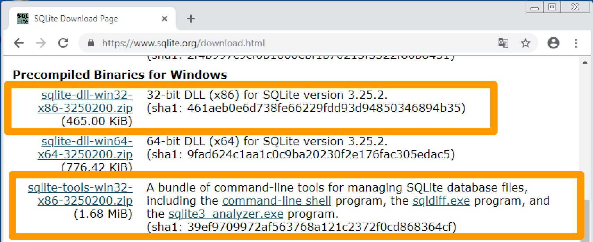
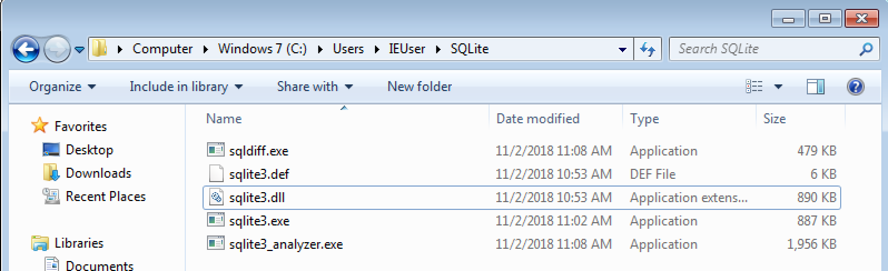
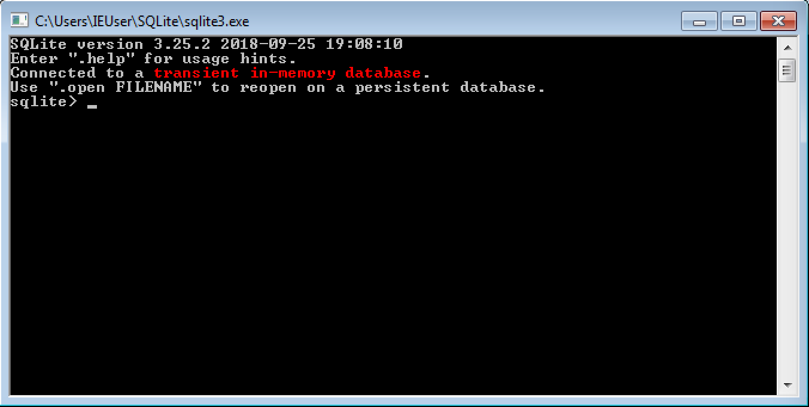

# SQLite

## SQLite란

SQLite는 데이터베이스 관리 시스템(DBMS; Database Management System)입니다. DBMS는 여러 사용자 또는 응용 프로그램이 데이터를 저장하거나 조화할 수 있게 도와주는 시스템 입니다. 대표적인 예로는 MySQL, PostgreSQL, Oracle 등이 있습니다.

SQLite는 설치나 설정에서 'Lite'한 DBMS 입니다. 어플리케이션에서 내부 데이터를 저장 할 때도 사용하기 적합하기 때문에 안드로이드나 아이폰 어플리케이션에서 많이 사용되고 있습니다.

SQLite의 특징으로는

1. 단일 데이터베이스 파일: SQLite에서는 모든 정보다 단 하나의 파일에 저장됩니다. 즉 테이블 스키마, 레코드 데이터, 인덱스과 같은 정보가 한 파일에 저장되며, SQLite API로 데이터베이스를 열 때도 해당 파일의 이름을 인자로 받습니다.
2. 간결성: 페이지 크기 제한이 있으며, 데이터베이스 파일이 파일시스템에 파일로 저장되기 때문에 파일 크기 제한이 있는 경우 데이터베이스가 동작하는데 문제가 생길 수 있습니다. 따라서 큰 데이터를 저장하지 않는 편이 좋고 어쩔 수 없는 경우에는 데이터를 여러 데이터베이스 파일로 나눠서 저장하는 것이 좋습니다.
3. 동시성: 읽기는 여러프로세스에서 가능하지만, 쓰기는 한 순간에 오직 하나의 프로세스만 가능합니다.
4. DROP COLUMN, ALTER COLUMN, ADD CONSTRAINT 같은 구문은 지원하지 않습니다. 하지만 동적 자료형(자료형은 그것을 저장하는 저장소가 아닌 값 자체에 의해 결정된다는 점- 테이블 생성시에 선언한 컬럼의 자료형과 일치하지 않는 데이터도 저장할 수 있다)과 RENAME TABLE을 활용하여 기능을 동일하게 구현할 수 있다.

## 윈도우에서 SQLite 설치하기

1. https://www.sqlite.org/download.html 다운로드 페이지에서 윈도우용 바이너리(Precomplied Binaries for Windows) 파일을 받는다. 밑의 경우 32비트라 tools를 포함해 두가지 파일을 받는다.
   

2. 다운로드한 ZIP파일들의 압축을 풀어 모두 원하는 폴더로 이동한다.
   

3. sqlite3.exe 파일을 더블클릭하여 실행한다.
   명령 프롬프트에서 다음과 같은 화면이 정상출력되면 설치된 것이다. 종료할 때는 .quit 을 입력한다.

   

참조 : 

- https://wikidocs.net/5326
- 모바일 데이터베이스 SQLite3 (위키북스)