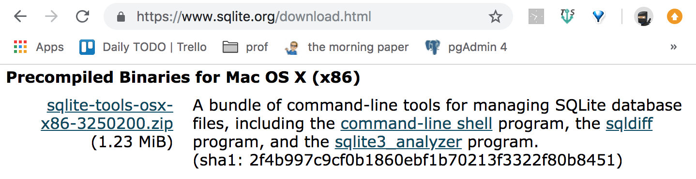
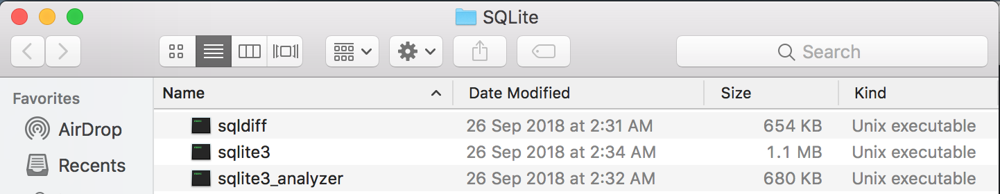
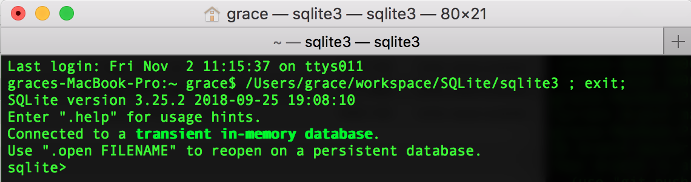

# SQLite

## Mac OS X에서 SQLite 설치하기

1. https://www.sqlite.org/download.html 다운로드 페이지에서 맥용 바이너리(Precomplied Binaries for Mac OS X) 파일을 받는다.
   

2. 다운로드한 ZIP파일의 압축을 풀어 원하는 폴더로 이동한다.
   sqlite3 파일을 더블클릭하여 실행한다.
   

3. 명령 프롬프트에서 다음과 같은 화면이 정상출력되면 설치된 것이다. 종료할 때는 .quit 을 입력한다.

   
