# MongoDB

## 1. MongoDB와 NoSQL

- MongoDB는 문서지향(Document-Oriented)적 Cross-platform 데이터베이스

- **확장성과 성능이 뛰어나며, 대표적인 NoSQL Database**

- **계층제어를 할 수 있는 데이터베이스**


### NoSQL?

- NoSQL은 Not Only SQL의 약자로 기존 RDBMS의 한계를 극복하고자 **고정된 스키마**나 JOIN이 존재하지 않는 데이터베이스의 형태

### 기존 RDBMS와의 차이

| **RDBMS**           | **MongoDB**        |
| ------------------- | ------------------ |
| Database            | Database           |
| Table               | Collection         |
| Tuple / Row         | Document           |
| Column              | Key / Field        |
| Table Join          | Embedded Documents |
| Primary Key         | Primary Key (_id)  |
| Oracle DB, MySQL 등 | MongoDB 등         |

#### Document

- Document는 하나의 의미를 지닌 데이터로 기존 RDBMS에서는 주로 Record, Tuple 등의 형태로 불리는 단위
- **기존 RDMBS와의 가장 큰 차이는 고정된 스키마가 존재하지 않기 때문에 하나의 Collection(Table)에 포함되는 Document(Record)가 서로 다른 데이터를 가지는 것이 가능**
- Key-Value pair로 구성(BSON: JSON 구조와 유사)

```json
{
    "_id": ObjectId("5bdd4d949b7e8a4674fa3014"),
	"name": "Lee",
	"age": 27,
	"address": "seoul",
    "favorite_movies": [
        {
            "id":1,
            "title":"Harry Potter and the Philosopher's Stone",
            "year": 2001
        },
        {
            "id":5,
            "title":"THe Fast and Furious",
            "year": 2009
        }
    ]
}
```

#### 기존 RDBMS 대비 장점 및 단점

- 장점
  - 고정된 스키마가 존재하지 않고, Document의 Value로 Document를 사용하는 것이 가능하기 때문에 기존 RDBMS에서 여러개의 Table로 구성하는 데이터를 하나의 Document로 구성하는 것이 가능
  - 고정된 스키마가 존재하지 않기 때문에 어떠한 형태의 데이터라도 쉽게 저장하는 것이 가능하며, JSON 형태를 띄고 있어서 직관적이고 개발이 용이
  - Replicate, Auto-Sharding 과 같은 기능을 통해 고가용성을 구현하기에 용이
- 단점
  - RDBMS에 비해 정합성이 떨어져 금용, 결제 등에서는 부적합한 부분이 존재
  - 기존 SQL을 모두 이전할 수 없어서 RDMBS에서 변경 시 별도의 작업이 필요
  - 메모리 관리를 DBMS가 아닌 OS에 위임함에 따라 성능의 차이가 발생
  - **RDBMS의 Join이 없어 단일 Collection 내에서 모든 Query를 처리해야함에 따른 비효율성**
  - 최대 Document 사이즈가 제한되어있습니다.
  - UPDATE 가 INSERT에 비해 현저히 느립니다.


## 2. MongoDB의 사용

### MongoDB를 사용하는 2가지 방법

1. 설치형 MongoDB를 Local 혹은 Server에 설치하여 사용
2. **MongDB Atlas를 통해 Free Cluster를 생성하여 사용**

#### MongoDB 직접 설치

- 직접 설치하기 위해서는 [mongoDB 홈페이지](https://www.mongodb.com/download-center?jmp=homepage#community)를 통해 설치파일을 다운로드 하여 설치를 진행

- MongoDB의 압축이 풀린 경로가 기본경로이며, OS 설정 및 다운로드 버전에 따라 경로는 상이

  - Windows: C:\Users\\*<USERNAME>*\Downloads\mongodb-win32-x86_64-2008plus-ssl-4.0.3\bin
  - OSX: /Users/*<USERNAME>*/Downloads/mongodb-osx-x86_64-4.0.3/bin

- Database 경로 지정하기

  - MongoDB의 기본 Database 경로는 Windows는 **C:\data\db** OSX은 **/data/db**
  - Database 경로가 존재하지 않으면 MongoDB를 실행할 때 에러 발생
  - 기본 Database 경로를 생성해 주거나 아래 명령어를 통해 Database 경로를 실제 존재하는 경로로 지정

  ```SHELL
  // Windows
  "C:\Users\<USERNAME>\Downloads\mongodb-win32-x86_64-2008plus-ssl-4.0.3\bin\mongod.exe" --dbpath d:\test\mongodb\data
  
  // OSX
  ~/Downloads/mongodb-osx-x86_64-4.0.3/bin/mongod --dbpath /test/mongodb/data
  ```

- MongoDB 실행하기

  ```shell
  // Windows
  "C:\Users\<USERNAME>\Downloads\mongodb-win32-x86_64-2008plus-ssl-4.0.3\bin\mongo.exe"
  
  // OSX
  ~/Downloads/mongodb-osx-x86_64-4.0.3/bin/mongo
  ```

#### MongoDB Atlas 활용하기

1. [MongoDB 홈페이지](https://www.mongodb.com/cloud) 접속 및 회원 가입
   https://www.mongodb.com/cloud 로 이동
   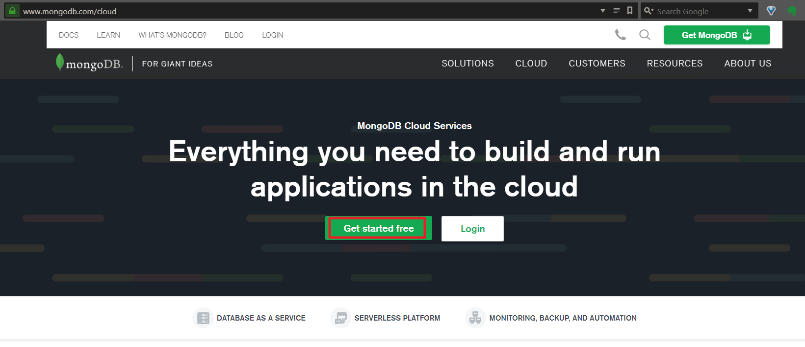
   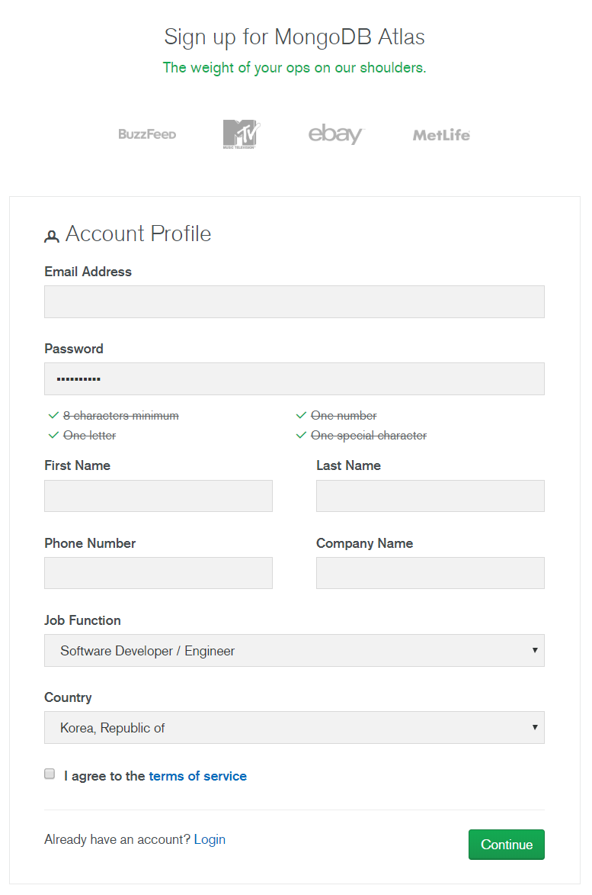

- Global Cluster Setting(Free Tier)

  - 무료로 제공되는 M0를 선택 
    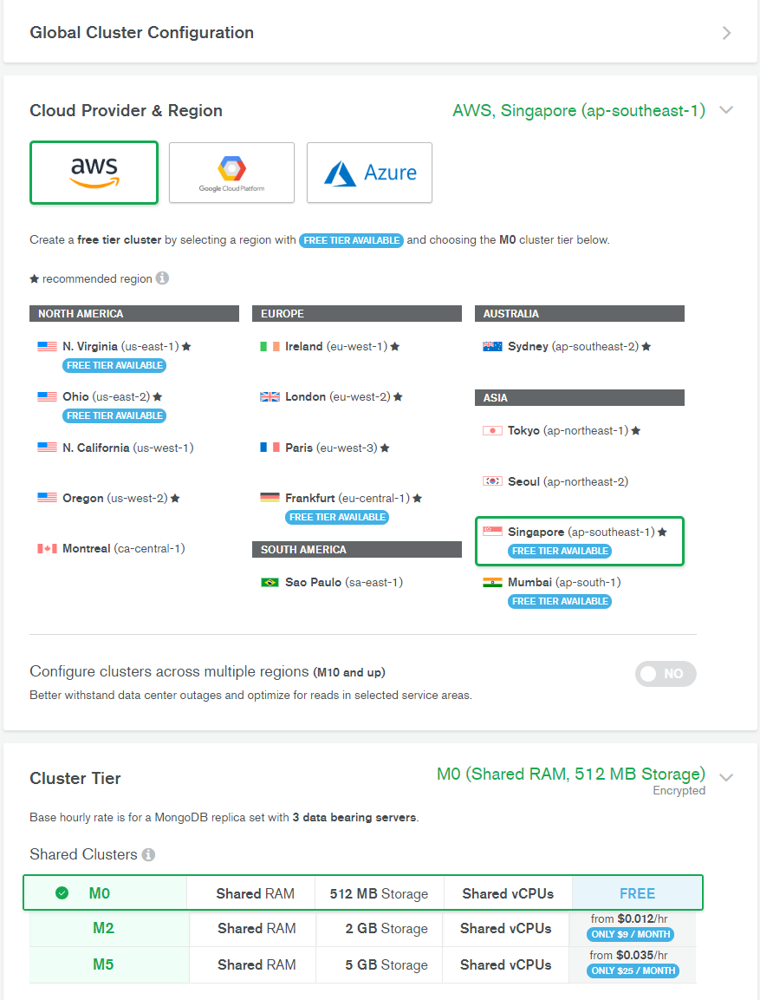
    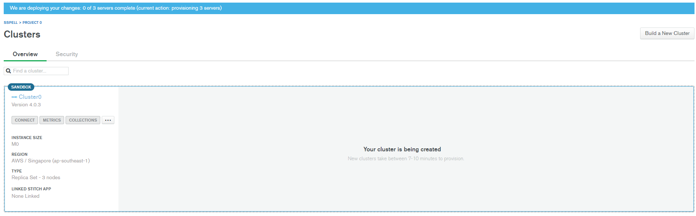


  2. User 생성 및 IP Whitelist 작성

     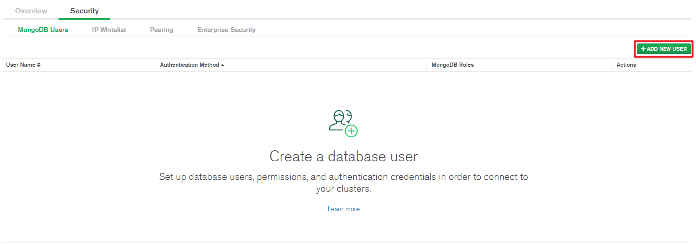
     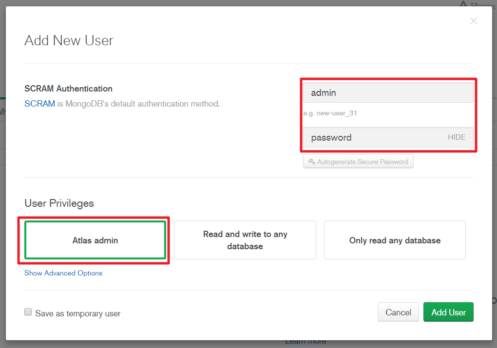


     IP Whitelist 추가: 실습에서는 편하게 활용하기 위해서, 전체 Access를 열어주겠습니다.

     실습 후에 활용하시는 용도에서는 꼭 이후에 삭제 해주시기 바랍니다.

     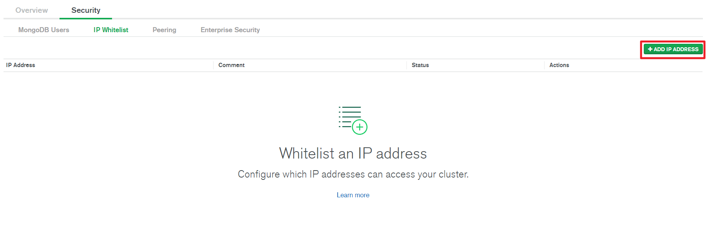
     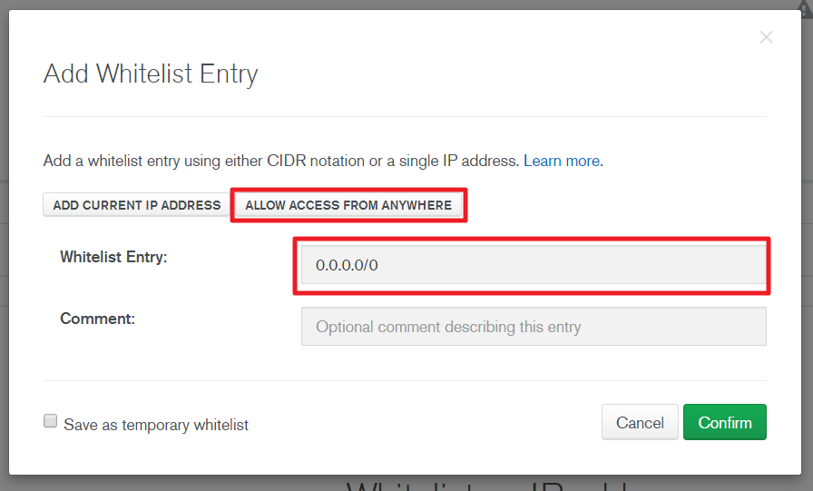


     삭제하는 방법 - IP Address 목록에서 DELETE버튼으로 삭제하시면 됩니다.

     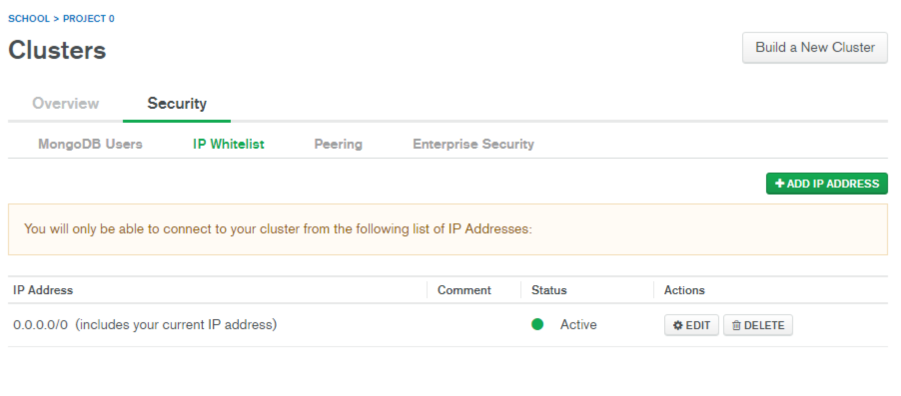


  3. MongoDB Atlas URL 확인하기
     
     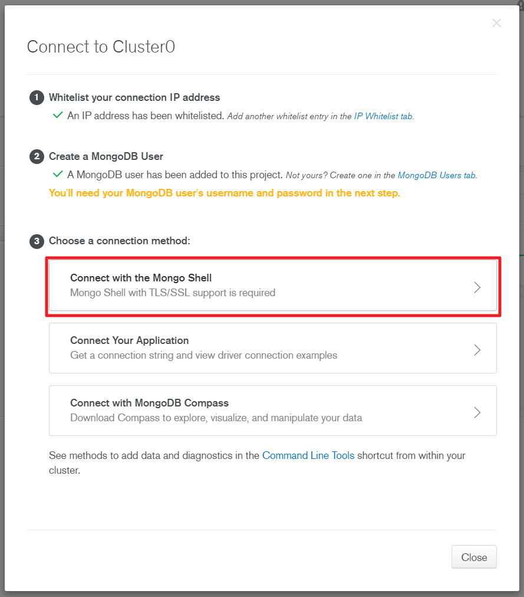
     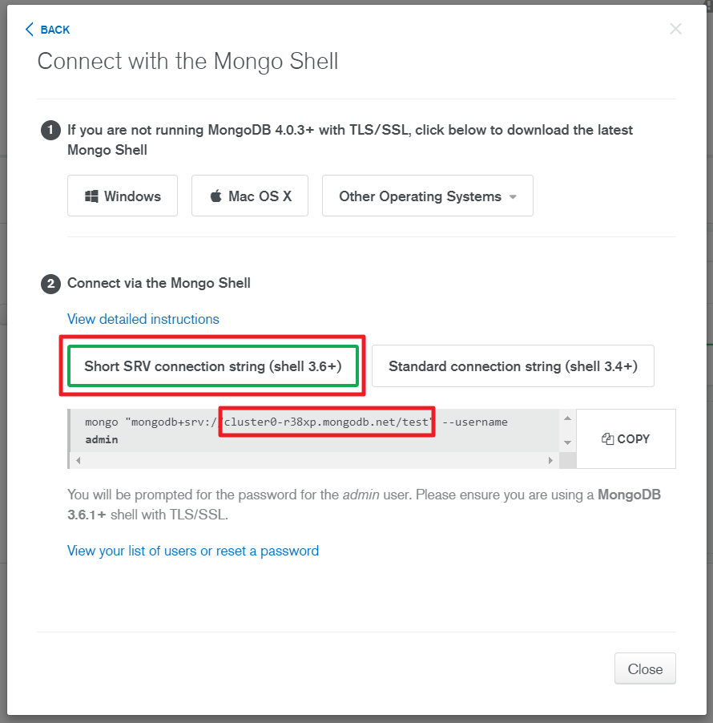

### MongoDB Shell 실행

#### Local MongoDB 접속

```shell
// Windows
"C:\Users\<USERNAME>\Downloads\mongodb-win32-x86_64-2008plus-ssl-4.0.3\bin\mongo.exe"

// OSX
~/Downloads/mongodb-osx-x86_64-4.0.3/bin/mongo
```

#### MongoDB Atlas 접속

```shell
// Windows
"C:\Users\<USERNAME>\Downloads\mongodb-win32-x86_64-2008plus-ssl-4.0.3\bin\mongo.exe" "mongodb+srv://[mongodb atlas url]" --username admin

// OSX
~/Downloads/mongodb-osx-x86_64-4.0.3/bin/mongo "mongodb+srv://[mongodb atlas url]" --username admin
```

- MongoDB Shell 종료: **Ctrl + D**

#### 오류 대응

- Windows 에서 MongoDB 압축 해제 후 MSVCP140.dll 오류로 Shell이 실행되지 않는 경우
  - PC에 설치된 Visual Studio의 visual C++이 구버전인 경우에 발생
  - [다음 주소](https://www.microsoft.com/ko-kr/download/confirmation.aspx?id=48145)에 접속하여 재배포 패키지를 다운로드 & 설치