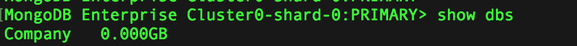
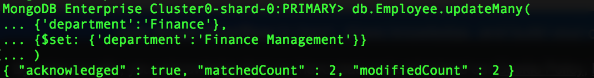
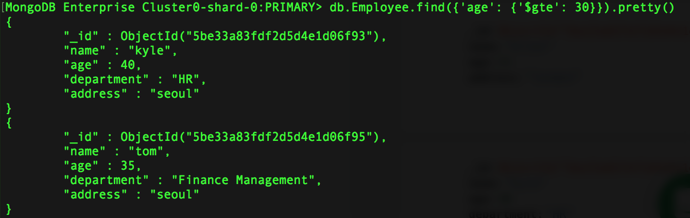
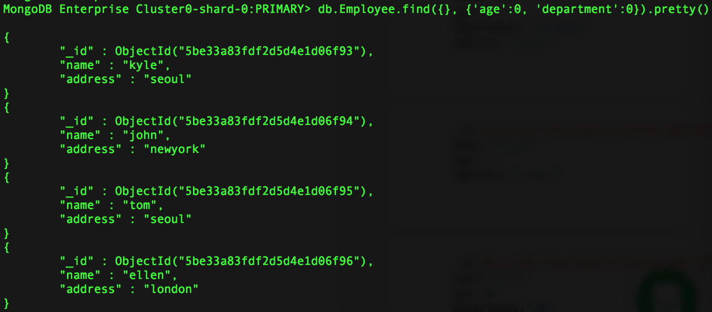

# MongoDB 활용

### Database 관리

| 명령어              | 설명                                                         |
| ------------------- | ------------------------------------------------------------ |
| use *DATABASE_NAME* | Database 선택(없는 경우 생성)                                |
| db                  | 현재 선택된 Database 확인                                    |
| show dbs            | 현재 User의 Database List 확인                               |
| db.dropDatabase()   | 현재 선택된 Database 제거<br />-단, 제거를 위해서는 제거 대상 Database이 선택되어 있어야 함 (use *DATABASE_NAME*) |


1. 먼저 예제로 진행해볼 간단한 데이터베이스를 생성하도록 하겠습니다. 직원들의 정보를 저장하는 **Employee** 데이터베이스를 생성해보도록 하겠습니다.


```shell
use Company
```


​	Company 데이터베이스로 잘 전환되었다는 안내가 뜹니다.


2. MongDB의 경우, 실제 콜렉션에 추가되기 전까지는 데이터베이스가 생성되지 않습니다.

   다음과 같이 show dbs를 실행해도 방금 저희가 생성한 데이터베이스는 보이지 않는 것을 확인하실 수 있습니다.

   ```shell
   show dbs
   ```

   


### Collection 관리

3. 이제, Company라는 데이터베이스 내부에 직원정보를 위한 Collection을 생성해보도록 하겠습니다.

   Collection 생성: **db.createCollection(name, [options])**


   ```shell
   db.createCollection("Employee")
   ```

   


| Field     | Type    | Description                                                  |
| --------- | ------- | ------------------------------------------------------------ |
| capped    | Boolean | 이 값을 true 로 설정하면 capped collection 을 활성화 시킵니다. Capped collection 이란, 고정된 크기(fixed size) 를 가진 컬렉션으로서, size 가 초과되면 가장 오래된 데이터를 덮어씁니다. **이 값을 true로 설정하면 size 값을 꼭 설정해야합니다.** |
| autoIndex | Boolean | 이 값을 true로 설정하면, _id 필드에 index를 자동으로 생성합니다. 기본값은 false 입니다. |
| size      | number  | Capped collection 을 위해 해당 컬렉션의 최대 사이즈(maximum size)를 ~ bytes로 지정합니다. |
| max       | number  | 해당 컬렉션에 추가 할 수 있는 최대 갯수를 설정합니다.        |

4. 추가된 Collection을 확인해보도록 하겠습니다.
   Collection List: **show collections**

```shell
show collections
```


Collection이 추가되었으니, 데이터베이스도 확인이 가능하겠죠?

```shell
show dbs
```



잘 추가가 된것을 보실 수 있습니다.

collection을 삭제하는 방법은 다음과 같은데, 일단 문서를 먼저 활용해보고 삭제를 실습하도록 하겠습니다.

Collection 제거: **db.*COLLECTION_NAME*.drop()**


```shell
db.createCollection("drop_test")
```


### Document 관리

5. 새로운 직원을 하나 추가해보도록 하겠습니다.
   Document 추가: **db.*COLLECTION_NAME*.insert(document)**

   간단하게 이름 속성을 가진 직원 문서 하나를 추가하겠습니다.

```shell
db.Employee.insert({'name':'grace'})
```


6. 방금 추가한 문서가 제대로 들어갔는지 확인해보도록 하겠습니다.
   Document 검색(SELECT): **db.*COLLECTION_NAME*.find()**

```shell
 // 전체 검색
db.Employee.find()
```


7. 방금전에 추가한 문서를 수정해서 부서라는 항목을 추가하고 싶습니다.

   Document 수정:

   여러 Document에 적용 : **db.*COLLECTION_NAME*.updateMany({query}, $set{})**

   ```shell
   db.Employee.updateMany({}, {$set: {'department':'IT'}})
   ```

   

   실제 업데이트 된 문서의 갯수를 확인 할 수 있습니다.

8. Update예제를 위해, 문서를 두개 정도 더 추가해보도록 하겠습니다.
   INSERT 시에 리스트의 형태로 []로 각 문서를 묶어서 입력하면 됩니다.

   ```shell
   db.Employee.insert([
   	{'name': 'kyle', 'age': 40, 'department':'HR', 'address': 'seoul'},
   	{'name': 'john', 'department':'Finance', 'address': 'newyork'},
   	{'name': 'tom', 'age': 35, 'department':'Finance', 'address': 'seoul'},
   	{'name': 'ellen', 'age': 21,'address': 'london'}
   	])
   ```

   

   잠깐 Atlas 사이트로 이동해서, 추가한 문서들이 잘 들어있는지 확인해보도록 하겠습니다.
   Cluster -> Collections -> Company -> Employee
   

   5개의 문서가 잘 추가되어있는 것을 보실 수 있습니다.

9. 그럼 여러 문서가 존재할때, 조건에 부합하는 문서만 수정하는 UPDATE를 실행해보도록 하겠습니다.
   여러 Document에 적용 : **db.*COLLECTION_NAME*.updateMany({query}, $set{})**
   예시로, Finance 부서 명이, Finance Management로 변경되었다고 해보겠습니다.

   ```shell
   db.Employee.updateMany(
   	{'department':'Finance'}, 
   	{$set: {'department':'Finance Management'}}
   )
   ```

   


   ```shell
   db.Employee.find().pretty()
   ```

   


10. 예시로 하나의 문서만 삭제해보도록 하겠습니다.
    Document 삭제: **db.*COLLECTION_NAME*.remove()**

```shell
db.Employee.remove({"name":"grace"})
```

### 

```
db.Employee.find()
```


### Document 조건 검색

11. 전체 문서를 말고 조건을 통한 문서 검색을 진행해보도록 하겠습니다.
    **db.*COLLECTION_NAME*.find(query, projection)**

```
// 조건 검색
db.Employee.find({'address':'seoul'}).pretty()
```


| Parameter  | Type     | Description                                                  |
| ---------- | -------- | ------------------------------------------------------------ |
| query      | document | Optional(선택적).  다큐먼트를 조회할 때 기준을 정합니다. 기준이 없이 컬렉션에 있는 모든 다큐먼트를 조회 할때는 이 매개변수를 비우거나 비어있는 다큐먼트 { } 를 전달하세요. |
| projection | document | Optional. 다큐먼트를 조회할 때 보여질 field를 정합니다. <br />field : 0 - exclude the field<br />field : 1 - include the field |


* 비교 연산자 사용

| Operator | Description                                            |
| -------- | ------------------------------------------------------ |
| $eq      | (equals) 주어진 값과 일치하는 값                       |
| $gt      | (greater than) 주어진 값보다 큰 값                     |
| $gte     | (greather than or equals) 주어진 값보다 크거나 같은 값 |
| $lt      | (less than) 주어진 값보다 작은 값                      |
| $lte     | (less than or equals) 주어진 값보다 작거나 같은 값     |
| $ne      | (not equal) 주어진 값과 일치하지 않는 값               |
| $in      | 주어진 배열 안에 속하는 값                             |
| $nin     | 주어빈 배열 안에 속하지 않는 값                        |


12. 비교 연산자 중에 $gte, 주어진 값보다 크거나 같은 값을 기준으로 검색해보도록 하겠습니다.
    나이를 기준으로 30대 이상 직원들을 검색해보겠습니다.

    ```shell
    db.Employee.find({'age': {'$gte': 30}}).pretty()
    ```

    


13. 비교 연산자 중에 $lte, 주어진 값보다 작거나 같은 값을 기준으로 검색해보도록 하겠습니다.

    나이를 기준으로 40대 미만 직원들을 검색해보겠습니다.


    ```shell
    db.Employee.find(
    	{'age': {'$lte': 40}}
    ).pretty()
    ```


14. 주어진 배열(리스트)안에 값이 존재하는 경우에 검색을 해주는 IN을 활용해보도록 하겠습니다.

    서울이나 런던에 살고 있는 직원들을 검색해보겠습니다.

    ```shell
    db.Employee.find(
    	{'address': 
    		{'$in': ['seoul', 'london']}
    	}
    ).pretty()
    ```

    


15. 그럼 위와 반대로, 만약 주어진 배열안에 값이 존재하지 않는 경우 검색하는 NIN를 활용해보겠습니다.
    검색시, john과 kyle 두 직원을 제외하고 싶다고 생각하겠습니다.

    ```shell
    db.Employee.find({'name': {'$nin': ['john', 'kyle']}}).pretty()
    ```

    


* 논리 연산자 사용

| Operator | Description                            |
| -------- | -------------------------------------- |
| $or      | 주어진 조건중 하나라도 true 일 때 true |
| $and     | 주어진 모든 조건이 true 일 때 true     |
| $not     | 주어진 조건이 false 일 때 true         |
| $nor     | 주어진 모든 조건이 false 일때 true     |


16. 논리 연산자 AND로 나이는 30세 이상이고 주소가 서울인 직원을 찾아보도록 하겠습니다.

    ```shell
    db.Employee.find(
    	{'$and': 
    		[
    			{'age': {'$gt':30}},
    			{'address': 'seoul'}
    		]
    	}
    ).pretty()
    ```

    


* Projection 사용
  * Projection이란 결과를 확인하고 싶은 Field의 목록
  * 기존 SQL의 SELECT와 FROM 사이에 들어가는 Column의 목록과 동일한 기능
  * Projection에 추가한 Field의 목록은 모두 true이거나 모두 false여야만 가능


  17. 전체 직원의 이름과 주소만 검색하고 싶다고 가정하겠습니다.

      ```shell
      db.Employee.find(
      	{}, 
      	{"name": true, "address": true}
      )
      ```

      

  18. 필드를 고르는 대신, 제거하고 싶은 필드를 조건에 추가하겠습니다.
      예로 직원들의 이름은 검색 결과에서 제외하고 싶습니다.

      ```shell
      db.Employee.find({}, {"name": false}).pretty()
      ```

      

  19. True, false값을 0, 1로 호출하는 것도 가능합니다.

  ```shell
  db.Employee.find({}, {'age':0, 'department':0}).pretty()
  ```

  


### Collection Update

* **db.*COLLECTION_NAME*.update(query, update, options)**

| Parameter    | Type     | Description                                                  |
| ------------ | -------- | ------------------------------------------------------------ |
| query        | document | 업데이트 할 document의 criteria 를 정합니다. find() 메소드에서 사용하는 query 와 같습니다. |
| update       | document | document에 적용할 변동사항입니다.                            |
| upsert       | boolean  | Optional. (기본값: false) 이 값이 true 로 설정되면 query한 document가 없을 경우, 새로운 document를 추가합니다. |
| multi        | boolean  | Optional. (기본값: false)  이 값이 true 로 설정되면, 여러개의 document 를 수정합니다. |
| writeConcern | document | Optional.  wtimeout 등 document 업데이트 할 때 필요한 설정값입니다. 기본 writeConcern을 사용하려면 이 파라미터를 생략하세요. |


**UPDATE wrapping methods** : 기존의 update메소드의 multi값을 세팅한 형태로 메소드를 제공합니다. 

| update     | 특징                           |
| ---------- | ------------------------------ |
| updateOne  | 매칭되는 문서 중 첫번째만 수정 |
| updateMany | 매칭 되는 모든 문서 수정       |
| replaceOne | 문서를 통째로 다른 것으로 대체 |


20. 위에서는 updateMany로 간단한 수정을 적용했었는데요, 기본적인 update()를 통해서도 가능합니다.

    ```shell
    db.Employee.update({'name': 'kyle'}, {'name': 'kyle', 'age': 25, 'address': 'london'})
    ```

    


    바뀐 값을 확인해보겠습니다.

    ```shell
    db.Employee.find({'name': 'kyle'}).pretty()
    ```

    


21. 위의 update 방식을 활용하면, 수정하지 않을 값인데로 지원지는 것을 방지하기 위해서 계속 값을 넣어줘야만 합니다. 그래서 update하는 필드만 지정하는 방식으로 set을 활용합니다.

* **${set}** 연산자를 통한 특정 Field의 Update

  ```shell
  db.Employee.update({'name': 'kyle'}, {'$set': {'age': 20}})
  ```

  


  ```shell
  db.Employee.find({'name': 'kyle'}).pretty()
  ```

  

  나이 값만 잘 수정된 것을 확인할 수 있습니다.


22. **UPSERT**
    MongoDB의 특별한 기능 중 하나는 upsert라고 하는 기능입니다. update + insert의 기능을 합친 용어입니다.
    **검색 조건에 만족하는 문서가 있다면 update하고,**
    **아니라면 새로 insert를 하게 해주는 옵션입니다.**


    새로 직원을 upsert기능을 통해서 추가해보도록 하겠습니다.

    ```shell
    db.Employee.update(
    	{'name': 'newbie'}, 
    	{'name': 'newbie', 'age': 21, 'address': 'tokyo'}, 
    	{'upsert': true}
    )
    ```

    

    기존에 동일한 이름이 존재하지 않기 때문에 새로운 문서가 추가된 것을 볼 수 있습니다.


### 기타 명렁어

23. 전체 직원 정보를 추출 할때, 나이 순으로 정렬하고 싶다면, sort()를 활용할 수 있습니다.

* 정렬: ***cursor*.sort()**
  * sort의 parameter로 조건을 부여
  * 1은 오름차순, -1은 내림차순

```shell
db.Employee.find().sort({'age': 1}).pretty()
```


정렬 조건이 되는 필드가 존재하지 않는 경우에 오름차순의 경우 앞에 포함된 것을 보실 수 있습니다. 반대로 내림차순이라면 마지막에 포함되게 될 것입니다.

24. 정렬 조건을 여러개로 추가해보겠습니다. 나이는 오른차순으로, 주소는 내림차순으로 한번 정렬해보겠습니다.

```shell
db.Employee.find().sort({'age': 1, 'address': -1}).pretty()
```


25. Dataframe에서 unique()처럼, 데이터베이스도 유일값을 확인 할수 있는 메소드를 제공해줍니다. 
    직원들의 주소의 유일값들을 한번 추출해보겠습니다.

* 유일값: **db.*COLLECTION_NAME*.distinct()**

```shell
db.Employee.distinct('address')
```


**그룹연산을 위한 기능을 MongoDB에서도 제공합니다. Aggregate는 실습 데이터가 추가된 상태로 pymongo 실습에서 진행하도록 하겠습니다.**


## References

* https://velopert.com


