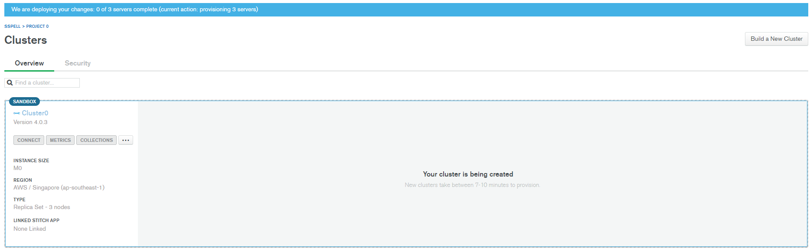
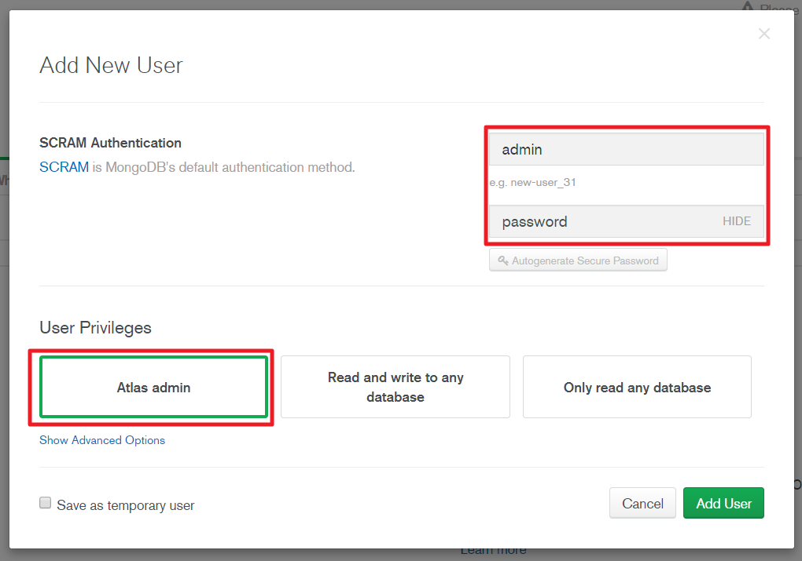
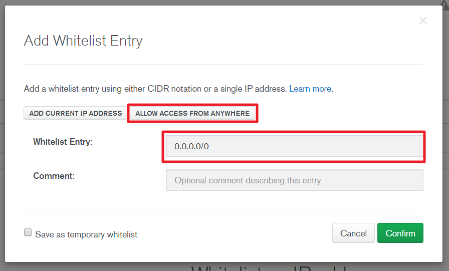
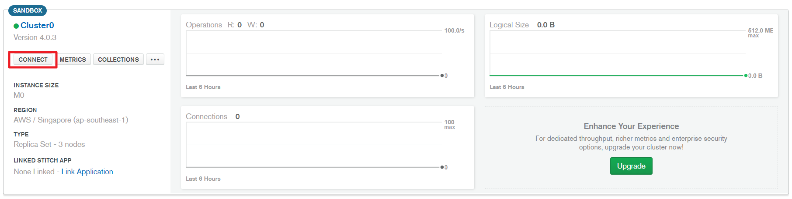

# MongoDB

## 1. MongoDB와 NoSQL

* MongoDB는 문서지향(Document-Oriented)적 Cross-platform 데이터베이스
* 확장성과 성능이 뛰어나며, 대표적인 NoSQL Database

### NoSQL?

* NoSQL은 Not Only SQL의 약자로 기존 RDBMS의 한계를 극복하고자 고정된 스키마나 JOIN이 존재하지 않는 데이터베이스의 형태

### 기존 RDBMS와의 차이

| **RDBMS**           | **MongoDB**        |
| ------------------- | ------------------ |
| Database            | Database           |
| Table               | Collection         |
| Tuple / Row         | Document           |
| Column              | Key / Field        |
| Table Join          | Embedded Documents |
| Primary Key         | Primary Key (_id)  |
| Oracle DB, MySQL 등 | MongoDB 등         |

#### Document

* Document는 하나의 의미를 지닌 데이터로 기존 RDBMS에서는 주로 Record, Tuple 등의 형태로 불리는 단위
* 기존 RDMBS와의 가장 큰 차이는 고정된 스키마가 존재하지 않기 때문에 하나의 Collection(Table)에 포함되는 Document(Record)가 서로 다른 데이터를 가지는 것이 가능
* Key-Value pair로 구성(JSON 구조와 유사)

```json
{
    "_id": ObjectId("5bdd4d949b7e8a4674fa3014"),
	"name": "grace",
	"age": 31,
	"address": "seoul"
}
```

#### 기존 RDBMS 대비 장점 및 단점

* 장점
  * 고정된 스키마가 존재하지 않고, Document의 Value로 Document를 사용하는 것이 가능하기 때문에 기존 RDBMS에서 여러개의 Table로 구성하는 데이터를 하나의 Document로 구성하는 것이 가능
  * 고정된 스키마가 존재하지 않기 때문에 어떠한 형태의 데이터라도 쉽게 저장하는 것이 가능하며, JSON 형태를 띄고 있어서 직관적이고 개발이 용이
  * Replicate, Auto-Sharding 과 같은 기능을 통해 고가용성을 구현하기에 용이
* 단점
  * RDBMS에 비해 정합성이 떨어져 금용, 결제 등에서는 부적합한 부분이 존재
  * 기존 SQL을 모두 이전할 수 없어서 RDMBS에서 변경 시 별도의 작업이 필요
  * 메모리 관리를 DBMS가 아닌 OS에 위임함에 따라 성능의 차이가 발생
  * RDBMS의 Join이 없어 단일 Collection 내에서 모든 Query를 처리해야함에 따른 비효율성


## 2. MongoDB의 사용

### MongoDB를 사용하는 2가지 방법

1. 설치형 MongoDB를 Local 혹은 Server에 설치하여 사용

2. MongDB Atlas를 통해 Free Cluster를 생성하여 사용

#### MongoDB 직접 설치

* 직접 설치하기 위해서는 [mongoDB 홈페이지](https://www.mongodb.com/download-center?jmp=homepage#community)를 통해 설치파일을 다운로드 하여 설치를 진행

* MongoDB의 압축이 풀린 경로가 기본경로이며, OS 설정 및 다운로드 버전에 따라 경로는 상이

  * Windows: C:\Users\\*<USERNAME>*\Downloads\mongodb-win32-x86_64-2008plus-ssl-4.0.3\bin
  * OSX: /Users/*<USERNAME>*/Downloads/mongodb-osx-x86_64-4.0.3/bin

* Database 경로 지정하기

  * MongoDB의 기본 Database 경로는 Windows는 **C:\data\db** OSX은 **/data/db**
  * Database 경로가 존재하지 않으면 MongoDB를 실행할 때 에러 발생
  * 기본 Database 경로를 생성해 주거나 아래 명령어를 통해 Database 경로를 실제 존재하는 경로로 지정

  ```SHELL
  // Windows
  "C:\Users\<USERNAME>\Downloads\mongodb-win32-x86_64-2008plus-ssl-4.0.3\bin\mongod.exe" --dbpath d:\test\mongodb\data
  
  // OSX
  ~/Downloads/mongodb-osx-x86_64-4.0.3/bin/mongod --dbpath /test/mongodb/data
  ```

* MongoDB 실행하기

  ```shell
  // Windows
  "C:\Users\<USERNAME>\Downloads\mongodb-win32-x86_64-2008plus-ssl-4.0.3\bin\mongo.exe"
  
  // OSX
  ~/Downloads/mongodb-osx-x86_64-4.0.3/bin/mongo
  ```

#### MongoDB Atlas 활용하기

* [MongoDB 홈페이지](https://www.mongodb.com/cloud) 접속 및 회원 가입
  
  
* Global Cluster Setting(Free Tier)
  * 무료로 제공되는 M0를 선택 
    
    
  * User 생성 및 IP Whitelist 작성
    
    
    
    
  * MongoDB Atlas URL 확인하기
    
    
    

### MongoDB Shell 실행

#### Local MongoDB 접속

```shell
// Windows
"C:\Users\<USERNAME>\Downloads\mongodb-win32-x86_64-2008plus-ssl-4.0.3\bin\mongo.exe"

// OSX
~/Downloads/mongodb-osx-x86_64-4.0.3/bin/mongo
```

#### MongoDB Atlas 접속

```shell
// Windows
"C:\Users\<USERNAME>\Downloads\mongodb-win32-x86_64-2008plus-ssl-4.0.3\bin\mongo.exe" "mongodb+srv://[mongodb atlas url]" --username admin

// OSX
~/Downloads/mongodb-osx-x86_64-4.0.3/bin/mongo "mongodb+srv://[mongodb atlas url]" --username admin
```

* MongoDB Shell 종료: **Ctrl + D**

#### 오류 대응

* Windows 에서 MongoDB 압축 해제 후 MSVCP140.dll 오류로 Shell이 실행되지 않는 경우
  * PC에 설치된 Visual Studio의 visual C++이 구버전인 경우에 발생
  * [다음 주소](https://www.microsoft.com/ko-kr/download/confirmation.aspx?id=48145)에 접속하여 재배포 패키지를 다운로드 & 설치

## 3. MongoDB 사용

### Database 관리

| 명령어              | 설명                                                         | 예시              |
| ------------------- | ------------------------------------------------------------ | ----------------- |
| use *DATABASE_NAME* | Database 선택(없는 경우 생성)                                | use Test          |
| db                  | 현재 선택된 Database 확인                                    | db                |
| show dbs            | 현재 User의 Database List 확인                               | show dbs          |
| db.dropDatabase()   | 현재 선택된 Database 제거<br />-단, 제거를 위해서는 제거 대상 Database이 선택되어 있어야 함 (use *DATABASE_NAME*) | dp.dropDatabase() |


```shell
> use Test
swithched to db Test
> db
Test
> show dbs
admin  0.000GB
config 0.000GB
local  0.000GB
```

### Collection 관리

* Collection 생성: **db.createCollection(name, [options])**

| Field     | Type    | Description                                                  |
| --------- | ------- | ------------------------------------------------------------ |
| capped    | Boolean | 이 값을 true 로 설정하면 capped collection 을 활성화 시킵니다. Capped collection 이란, 고정된 크기(fixed size) 를 가진 컬렉션으로서, size 가 초과되면 가장 오래된 데이터를 덮어씁니다. **이 값을 true로 설정하면 size 값을 꼭 설정해야합니다.** |
| autoIndex | Boolean | 이 값을 true로 설정하면, _id 필드에 index를 자동으로 생성합니다. 기본값은 false 입니다. |
| size      | number  | Capped collection 을 위해 해당 컬렉션의 최대 사이즈(maximum size)를 ~ bytes로 지정합니다. |
| max       | number  | 해당 컬렉션에 추가 할 수 있는 최대 갯수를 설정합니다.        |

* Collection List: **show collections**

```shell
> db.createCollection("test_collection")
{ "ok" : 1 }
> show collections
test_collection
```

* Collection 제거: **db.*COLLECTION_NAME*.drop()**


```shell
> db.createCollection("drop_test")
{ "ok" : 1 }
> show collections
drop_test
test_collection
> db.drop_test.drop()
treu
> show collections
test_collection
```

### Document 관리

* Document 추가: **db.*COLLECTION_NAME*.insert(document)**

```shell
> db.test_collection.insert({'name':'grace'})
WriteResult({ "nInserted" : 1 })
```

* Document 검색(SELECT): **db.*COLLECTION_NAME*.find()**

```shell
> db.test_collection.find() // 전체 검색
{ "_id" : ObjectId("5be07aad1632ee81ef7ce12e"), "name" : "grace" }
> db.test_collection.find({'name':'grace'}) // 조건 검색
{ "_id" : ObjectId("5be07aad1632ee81ef7ce12e"), "name" : "grace" }
```

* Document 삭제: **db.*COLLECTION_NAME*.remove()**

```shell
> db.test_collection.remove({"name":"grace'})
WriteResult({ "nRemoved" : 1 })
> db.test_collection.find()

```

### Document 조건 검색

* **db.*COLLECTION_NAME*.find(query, projection)**
  * 보다 미려한 결과값을 보려면 .pretty() 사용

| Parameter  | Type     | Description                                                  |
| ---------- | -------- | ------------------------------------------------------------ |
| query      | document | Optional(선택적).  다큐먼트를 조회할 때 기준을 정합니다. 기준이 없이 컬렉션에 있는 모든 다큐먼트를 조회 할때는 이 매개변수를 비우거나 비어있는 다큐먼트 { } 를 전달하세요. |
| projection | document | Optional. 다큐먼트를 조회할 때 보여질 field를 정합니다.      |

```shell
> db.test_collection.insert(
... [{'name': 'grace',
... 'age': 43,
... 'address': 'seoul'},
... {  'name': 'kyle',
... 'age': 62,
... 'address': 'seoul'},
... {'name': 'john',
... 'age': 10,
... 'address': 'newyork'},
... {'name': 'tom',
... 'age': 12,
... 'address': 'seoul'},
... {'name': 'ellen',
... 'age': 21,
... 'address': 'london'}]
... )
BulkWriteResult({
    "writeError" : [ ],
    "writeConcernErrors" : [ ],
    "nInserted" : 5,
    "nUpserted" : 0,
    "nMatched" : 0,
    "nModified" : 0,
    "nRemoved" : 0,
    "upserted" : [ ]
})

> db.test_collection.find({'address': 'seoul'})
{ "_id" : ObjectId("5be07f291632ee81ef7ce12f"), "name" : "grace", "age" : 43, "a
ddress" : "seoul" }
{ "_id" : ObjectId("5be07f291632ee81ef7ce130"), "name" : "kyle", "age" : 62, "ad
dress" : "seoul" }
{ "_id" : ObjectId("5be07f291632ee81ef7ce132"), "name" : "tom", "age" : 12, "add
ress" : "seoul" }
```

* 비교 연산자 사용

| Operator | Description                                            |
| -------- | ------------------------------------------------------ |
| $eq      | (equals) 주어진 값과 일치하는 값                       |
| $gt      | (greater than) 주어진 값보다 큰 값                     |
| $gte     | (greather than or equals) 주어진 값보다 크거나 같은 값 |
| $lt      | (less than) 주어진 값보다 작은 값                      |
| $lte     | (less than or equals) 주어진 값보다 작거나 같은 값     |
| $ne      | (not equal) 주어진 값과 일치하지 않는 값               |
| $in      | 주어진 배열 안에 속하는 값                             |
| $nin     | 주어빈 배열 안에 속하지 않는 값                        |

```shell
> db.test_collection.find({'age': {'$gte': 40}})
{ "_id" : ObjectId("5be07f291632ee81ef7ce12f"), "name" : "grace", "age" : 43, "a
ddress" : "seoul" }
{ "_id" : ObjectId("5be07f291632ee81ef7ce130"), "name" : "kyle", "age" : 62, "ad
dress" : "seoul" }

> db.test_collection.find({'age': {'$lte': 40}})
{ "_id" : ObjectId("5be07f291632ee81ef7ce131"), "name" : "john", "age" : 10, "ad
dress" : "newyork" }
{ "_id" : ObjectId("5be07f291632ee81ef7ce132"), "name" : "tom", "age" : 12, "add
ress" : "seoul" }
{ "_id" : ObjectId("5be07f291632ee81ef7ce133"), "name" : "ellen", "age" : 21, "a
ddress" : "london" }

> db.test_collection.find({'address': {'$in': ['seoul', 'london']}})
{ "_id" : ObjectId("5be07f291632ee81ef7ce12f"), "name" : "grace", "age" : 43, "a
ddress" : "seoul" }
{ "_id" : ObjectId("5be07f291632ee81ef7ce130"), "name" : "kyle", "age" : 62, "ad
dress" : "seoul" }
{ "_id" : ObjectId("5be07f291632ee81ef7ce132"), "name" : "tom", "age" : 12, "add
ress" : "seoul" }
{ "_id" : ObjectId("5be07f291632ee81ef7ce133"), "name" : "ellen", "age" : 21, "a
ddress" : "london" }

> db.test_collection.find({'name': {'$nin': ['john', 'kyle']}})
{ "_id" : ObjectId("5be07f291632ee81ef7ce12f"), "name" : "grace", "age" : 43, "a
ddress" : "seoul" }
{ "_id" : ObjectId("5be07f291632ee81ef7ce132"), "name" : "tom", "age" : 12, "add
ress" : "seoul" }
{ "_id" : ObjectId("5be07f291632ee81ef7ce133"), "name" : "ellen", "age" : 21, "a
ddress" : "london" }
```

* 논리 연산자 사용

| Operator | Description                            |
| -------- | -------------------------------------- |
| $or      | 주어진 조건중 하나라도 true 일 때 true |
| $and     | 주어진 모든 조건이 true 일 때 true     |
| $not     | 주어진 조건이 false 일 때 true         |
| $nor     | 주어진 모든 조건이 false 일때 true     |

```shell
> db.test_collection.find({'$and': [{'age': {'$gt': 30}}, {'address': 'seoul'}]})
{ "_id" : ObjectId("5be07f291632ee81ef7ce12f"), "name" : "grace", "age" : 43, "a
ddress" : "seoul" }
{ "_id" : ObjectId("5be07f291632ee81ef7ce130"), "name" : "kyle", "age" : 62, "ad
dress" : "seoul" }

> db.test_collection.find({'$or': [{'age': {'$lt': 25}}, {'address': 'seoul'}]})
{ "_id" : ObjectId("5be07f291632ee81ef7ce12f"), "name" : "grace", "age" : 43, "a
ddress" : "seoul" }
{ "_id" : ObjectId("5be07f291632ee81ef7ce130"), "name" : "kyle", "age" : 62, "ad
dress" : "seoul" }
{ "_id" : ObjectId("5be07f291632ee81ef7ce131"), "name" : "john", "age" : 10, "ad
dress" : "newyork" }
{ "_id" : ObjectId("5be07f291632ee81ef7ce132"), "name" : "tom", "age" : 12, "add
ress" : "seoul" }
{ "_id" : ObjectId("5be07f291632ee81ef7ce133"), "name" : "ellen", "age" : 21, "a
ddress" : "london" }
```

* Projection 사용
  * Projection이란 결과를 확인하고 싶은 Field의 목록
  * 기존 SQL의 SELECT와 FROM 사이에 들어가는 Column의 목록과 동일한 기능
  * Projection에 추가한 Field의 목록은 모두 true이거나 모두 false여야만 가능

```shell
> db.test_collection.find({}, {"name": true, "address": true})
{ "_id" : ObjectId("5be07f291632ee81ef7ce12f"), "name" : "grace", "address" : "s
eoul" }
{ "_id" : ObjectId("5be07f291632ee81ef7ce130"), "name" : "kyle", "address" : "se
oul" }
{ "_id" : ObjectId("5be07f291632ee81ef7ce131"), "name" : "john", "address" : "ne
wyork" }
{ "_id" : ObjectId("5be07f291632ee81ef7ce132"), "name" : "tom", "address" : "seo
ul" }
{ "_id" : ObjectId("5be07f291632ee81ef7ce133"), "name" : "ellen", "address" : "l
ondon" }

> db.test_collection.find({}, {"name": false})
{ "_id" : ObjectId("5be07f291632ee81ef7ce12f"), "age" : 43, "address" : "seoul"
}
{ "_id" : ObjectId("5be07f291632ee81ef7ce130"), "age" : 62, "address" : "seoul"
}
{ "_id" : ObjectId("5be07f291632ee81ef7ce131"), "age" : 10, "address" : "newyork
" }
{ "_id" : ObjectId("5be07f291632ee81ef7ce132"), "age" : 12, "address" : "seoul"
}
{ "_id" : ObjectId("5be07f291632ee81ef7ce133"), "age" : 21, "address" : "london"
 }
```

### Collection Update

* **db.*COLLECTION_NAME*.update(query, update, options)**

| Parameter    | Type     | Description                                                  |
| ------------ | -------- | ------------------------------------------------------------ |
| query        | document | 업데이트 할 document의 criteria 를 정합니다. find() 메소드에서 사용하는 query 와 같습니다. |
| update       | document | document에 적용할 변동사항입니다.                            |
| upsert       | boolean  | Optional. (기본값: false) 이 값이 true 로 설정되면 query한 document가 없을 경우, 새로운 document를 추가합니다. |
| multi        | boolean  | Optional. (기본값: false)  이 값이 true 로 설정되면, 여러개의 document 를 수정합니다. |
| writeConcern | document | Optional.  wtimeout 등 document 업데이트 할 때 필요한 설정값입니다. 기본 writeConcern을 사용하려면 이 파라미터를 생략하세요. |

```shell
> db.test_collection.find({'naem': 'grace'})
{ "_id" : ObjectId("5be07f291632ee81ef7ce12f"), "name" : "grace", "age" : 43, "a
ddress" : "seoul" }

> db.test_collection.update({'name': 'grace'}, {'name': 'grace', 'age': 5, 'address': 'london'})
WriteResult({ "nMatched" : 1, "nUpserted" : 0, "nModified" : 1 })

> db.test_collection.find({'naem': 'grace'})
{ "_id" : ObjectId("5be07f291632ee81ef7ce12f"), "name" : "grace", "age" : 5, "ad
dress" : "london" }
```

* **${set}** 연산자를 통한 특정 Field의 Update

```shell
> db.test_collection.find({'naem': 'kyle'})
{ "_id" : ObjectId("5be07f291632ee81ef7ce130"), "name" : "kyle", "age" : 62, "ad
dress" : "seoul" }

> db.test_collection.update({'name': 'kyle'}, {'$set': {'age': 100}})
WriteResult({ "nMatched" : 1, "nUpserted" : 0, "nModified" : 1 })

> db.test_collection.find({'naem': 'kyle'})
{ "_id" : ObjectId("5be07f291632ee81ef7ce130"), "name" : "kyle", "age" : 100, "a
ddress" : "seoul" }
```

* option의 활용

```shell
> db.test_collection.find()
{ "_id" : ObjectId("5be07f291632ee81ef7ce12f"), "name" : "grace", "age" : 5, "ad
dress" : "london" }
{ "_id" : ObjectId("5be07f291632ee81ef7ce130"), "name" : "kyle", "age" : 100, "a
ddress" : "seoul" }
{ "_id" : ObjectId("5be07f291632ee81ef7ce131"), "name" : "john", "age" : 10, "ad
dress" : "newyork" }
{ "_id" : ObjectId("5be07f291632ee81ef7ce132"), "name" : "tom", "age" : 12, "add
ress" : "seoul" }
{ "_id" : ObjectId("5be07f291632ee81ef7ce133"), "name" : "ellen", "age" : 21, "a
ddress" : "london" }

> db.test_collection.update({'name': 'newbie'}, {'name': 'newbie', 'age': 1, 'address': 'tokyo'}, {'upsert': true})
WriteResult({
        "nMatched" : 0,
        "nUpserted" : 1,
        "nModified" : 0,
        "_id" : ObjectId("5be08a8528f119b19a8ea978")
})

> db.test_collection.find()
{ "_id" : ObjectId("5be07f291632ee81ef7ce12f"), "name" : "grace", "age" : 5, "ad
dress" : "london" }
{ "_id" : ObjectId("5be07f291632ee81ef7ce130"), "name" : "kyle", "age" : 100, "a
ddress" : "seoul" }
{ "_id" : ObjectId("5be07f291632ee81ef7ce131"), "name" : "john", "age" : 10, "ad
dress" : "newyork" }
{ "_id" : ObjectId("5be07f291632ee81ef7ce132"), "name" : "tom", "age" : 12, "add
ress" : "seoul" }
{ "_id" : ObjectId("5be07f291632ee81ef7ce133"), "name" : "ellen", "age" : 21, "a
ddress" : "london" }
{ "_id" : ObjectId("5be08a8528f119b19a8ea978"), "name" : "newbie", "age" : 1, "a
ddress" : "tokyo" }

> db.test_collection.update({'address': 'london'}, {'$set': {'address': 'busan'}}, {'multi': true})
WriteResult({ "nMatched" : 2, "nUpserted" : 0, "nModified" : 2 })

> db.test_collection.find()
{ "_id" : ObjectId("5be07f291632ee81ef7ce12f"), "name" : "grace", "age" : 5, "ad
dress" : "busan" }
{ "_id" : ObjectId("5be07f291632ee81ef7ce130"), "name" : "kyle", "age" : 100, "a
ddress" : "seoul" }
{ "_id" : ObjectId("5be07f291632ee81ef7ce131"), "name" : "john", "age" : 10, "ad
dress" : "newyork" }
{ "_id" : ObjectId("5be07f291632ee81ef7ce132"), "name" : "tom", "age" : 12, "add
ress" : "seoul" }
{ "_id" : ObjectId("5be07f291632ee81ef7ce133"), "name" : "ellen", "age" : 21, "a
ddress" : "busan" }
{ "_id" : ObjectId("5be08a8528f119b19a8ea978"), "name" : "newbie", "age" : 1, "a
ddress" : "tokyo" }
```

### 기타 명렁어

* 정렬: ***cursor*.sort()**
  * sort의 parameter로 조건을 부여
  * 1은 오름차순, -1은 내림차순

```shell
> db.test_collection.find().sort({'age': 1, 'address': -1}).pretty()
{
        "_id" : ObjectId("5be08a8528f119b19a8ea978"),
        "name" : "newbie",
        "age" : 1,
        "address" : "tokyo"
}
{
        "_id" : ObjectId("5be07f291632ee81ef7ce12f"),
        "name" : "grace",
        "age" : 5,
        "address" : "busan"
}
{
        "_id" : ObjectId("5be07f291632ee81ef7ce131"),
        "name" : "john",
        "age" : 10,
        "address" : "newyork"
}
{
        "_id" : ObjectId("5be07f291632ee81ef7ce132"),
        "name" : "tom",
        "age" : 12,
        "address" : "seoul"
}
{
        "_id" : ObjectId("5be07f291632ee81ef7ce133"),
        "name" : "ellen",
        "age" : 21,
        "address" : "busan"
}
{
        "_id" : ObjectId("5be07f291632ee81ef7ce130"),
        "name" : "kyle",
        "age" : 100,
        "address" : "seoul"
}
```

* 유일값: **db.*COLLECTION_NAME*.distinct()**

```shell
> db.test_collection.distinct('address')
[ "busan", "seoul", "newyork", "tokyo" ]
```

## References

* https://velopert.com


